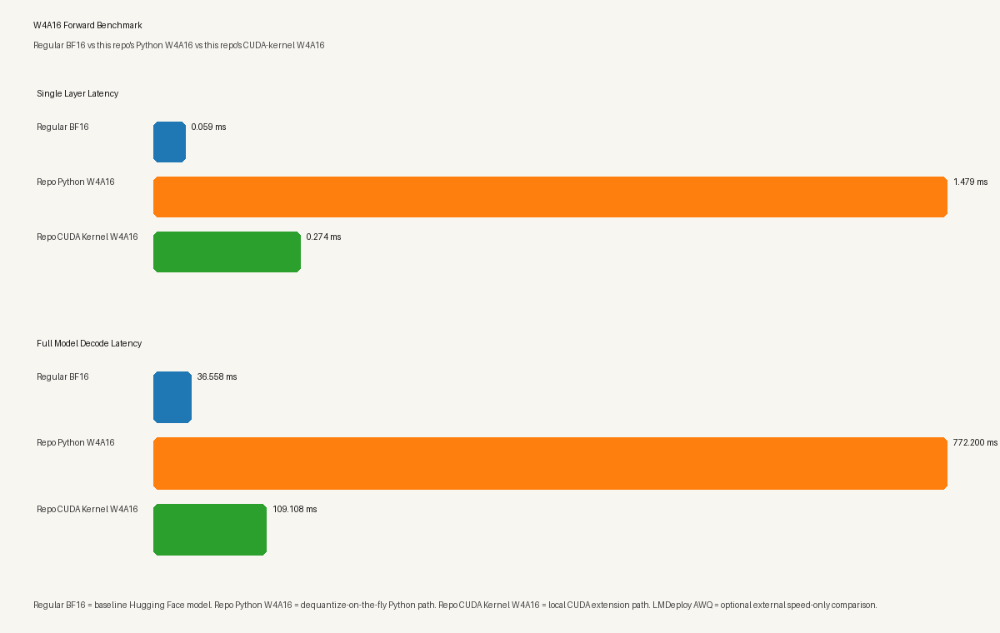

# W4A16 LLaMA Benchmark Repo

This repository compares a regular causal language model against a naive W4A16 quantized variant on:

1. WikiText-2 perplexity
2. Single-layer forward speed
3. Full-model one-token decode speed

It also includes:

- a CUDA extension source for a custom W4A16 GEMV kernel
- a forward benchmark that can optionally compare against an LMDeploy AWQ model for speed only

## Variant Names

- `Regular BF16`: the baseline Hugging Face model with no quantization.
- `Repo Python W4A16`: this repo's quantized path that dequantizes weights in Python during `forward()`.
- `Repo CUDA Kernel W4A16`: this repo's quantized path using the local CUDA extension in [w4a16_cuda.cu](/workspace/W4A16/w4a16_cuda.cu).
- `LMDeploy AWQ`: LMDeploy's own AWQ implementation, benchmarked only for speed when you provide an LMDeploy-compatible model path.

## What Is Actually In This Repo

```text
.
├── AGENTS.md
├── evaluation.py
├── forward_pass_benchmark.py
├── initial_script.py
├── quantization.py
├── sanity_checks.py
├── w4a16_cuda.cu
├── perplexity_results.json
├── perplexity_results.csv
└── perplexity_run.log
```

## Current Implementation

### Quantization path

- `quantization.py` implements naive per-group asymmetric 4-bit weight quantization.
- `QuantizedLinear4bit` stores packed 4-bit weights and dequantizes them on the fly in Python during `forward`.
- `CudaKernelQuantizedLinear4bit` is available for benchmarking and uses the local CUDA extension in `w4a16_cuda.cu`.
- `quantize_model_layers(...)` deep-copies a model and replaces every `nn.Linear`.

### Perplexity path

- `initial_script.py` loads `meta-llama/Meta-Llama-3.1-8B`
- quantizes all `nn.Linear` layers with group size `64`
- evaluates both regular and quantized models on the WikiText-2 test split

### Benchmark path

`forward_pass_benchmark.py` benchmarks:

- `Regular BF16`: baseline `nn.Linear` / baseline full model
- `Repo Python W4A16`: this repo's Python dequantization path
- `Repo CUDA Kernel W4A16`: this repo's local CUDA kernel path
- optional `LMDeploy AWQ`: an LMDeploy AWQ model path, speed only, not perplexity

## Known Runtime Constraint

The Llama 8B checkpoint does work on this machine, but it does **not** fit if Hugging Face caches into `/workspace/.hf_home` on the small overlay filesystem.

Use:

```bash
mkdir -p /dev/shm/hf_home /dev/shm/tmp
HF_HOME=/dev/shm/hf_home TMPDIR=/dev/shm/tmp python /workspace/W4A16/initial_script.py
```

Use the same cache redirection for the benchmark:

```bash
HF_HOME=/dev/shm/hf_home TMPDIR=/dev/shm/tmp python /workspace/W4A16/forward_pass_benchmark.py --hf-token "$HF_TOKEN" --enable-cuda-kernel
```

## Perplexity Result In This Repo

From [perplexity_results.json](/workspace/W4A16/perplexity_results.json):

- Model: `meta-llama/Meta-Llama-3.1-8B`
- Dataset: `wikitext-2-raw-v1:test`
- Regular perplexity: `13.0328`
- Quantized perplexity: `15.3972`
- Delta: `+2.3644`
- Regular model size: `15316.51 MB`
- Quantized model size: `5028.32 MB`

## Benchmark Result In This Repo

From the latest smoke run in [benchmark_run.log](/workspace/W4A16/benchmark_run.log) and [benchmark_results.json](/workspace/W4A16/benchmark_results.json):



The plot is meant to answer one question quickly:

- `Regular BF16` is the baseline to beat.
- `Repo Python W4A16` shows the cost of dequantizing in Python every forward pass.
- `Repo CUDA Kernel W4A16` shows what improves once the heavy part moves into the local CUDA kernel.
- `LMDeploy AWQ`, when provided, is an external reference point for speed only.

### Single Linear Layer

- `Regular BF16`: `0.059 ms`
- `Repo Python W4A16`: `1.479 ms`
- `Repo CUDA Kernel W4A16`: `0.274 ms`

### Full Model, One Decode Token

- `Regular BF16`: `36.558 ms`
- `Repo Python W4A16`: `772.200 ms`
- `Repo CUDA Kernel W4A16`: `109.108 ms`

These numbers show the intended comparison clearly:

- the pure Python dequant path is the main bottleneck
- this repo's CUDA kernel is much faster than this repo's Python W4A16 path
- on the current implementation, `Regular BF16` is still faster than both quantized paths

## LMDeploy Comparison

`forward_pass_benchmark.py` supports an optional LMDeploy speed-only comparison:

```bash
HF_HOME=/dev/shm/hf_home TMPDIR=/dev/shm/tmp python /workspace/W4A16/forward_pass_benchmark.py \
  --hf-token "$HF_TOKEN" \
  --enable-cuda-kernel \
  --lmdeploy-model-path /path/to/awq-model \
  --lmdeploy-backend pytorch
```

Notes:

- this comparison is **speed only**
- it does **not** participate in the perplexity script
- it expects an already prepared LMDeploy-compatible AWQ model path
- the benchmark measures end-to-end generation latency for `max_new_tokens=1`, not raw Hugging Face `forward(...)`

## Files

- [initial_script.py](/workspace/W4A16/initial_script.py): perplexity entrypoint
- [evaluation.py](/workspace/W4A16/evaluation.py): dataset prep and perplexity evaluation
- [quantization.py](/workspace/W4A16/quantization.py): quantization helpers and quantized linear modules
- [sanity_checks.py](/workspace/W4A16/sanity_checks.py): forward-output comparison helper
- [forward_pass_benchmark.py](/workspace/W4A16/forward_pass_benchmark.py): speed benchmark entrypoint
- [w4a16_cuda.cu](/workspace/W4A16/w4a16_cuda.cu): CUDA extension source

## What This README Does Not Claim

This repo does **not** currently contain:

- a packaged build system such as `setup.py`
- a `requirements.txt`
- a `benchmarks/`, `tests/`, `eval/`, or `quantize/` directory layout
- validated production W4A16 throughput improvements end to end
- an integrated LMDeploy perplexity path
